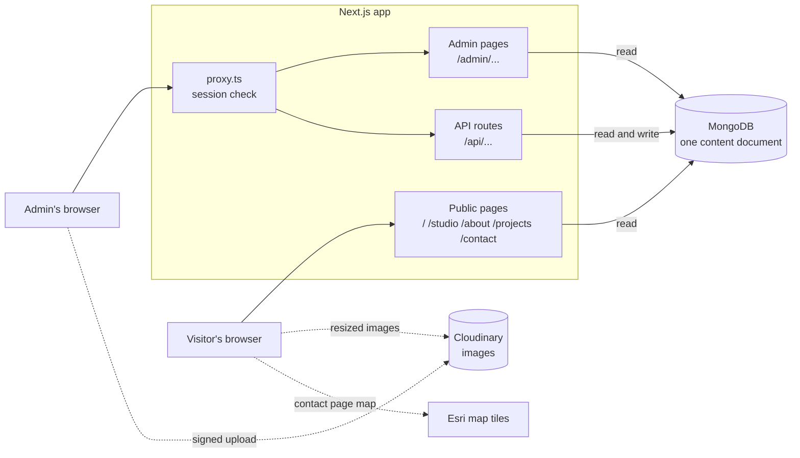
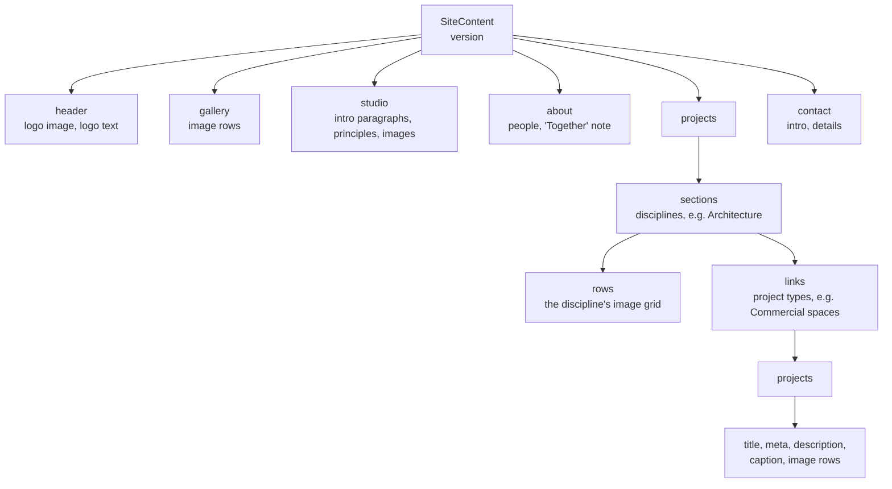
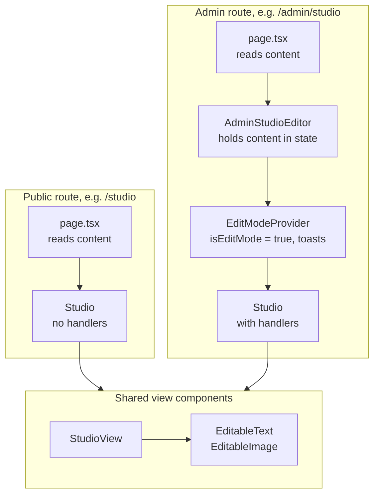
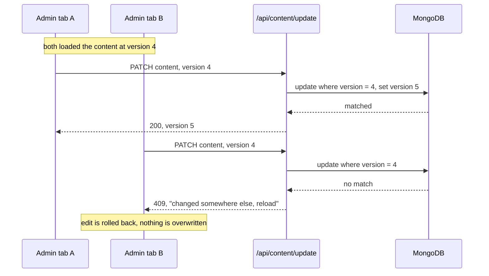
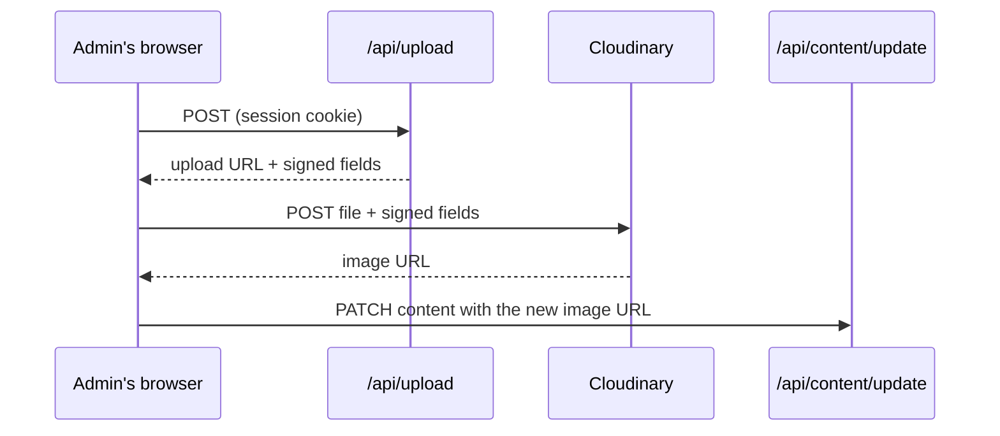

# HS Architects

Portfolio site for HS Architects, with a built-in editor so the studio can change text and images without touching code.

Built with Next.js 16 (App Router), React 19, Tailwind CSS v4, MongoDB for content and Cloudinary for images.

- [Setup](#setup)
- [Architecture](#architecture)
  - [System overview](#system-overview)
  - [Pages](#pages)
  - [Content model](#content-model)
  - [How editing works](#how-editing-works)
  - [Saving](#saving)
  - [Images](#images)
  - [Sign-in](#sign-in)
- [Project layout](#project-layout)
- [Commands](#commands)

## Setup

1. `npm install`
2. Copy `.env.example` to `.env.local` and fill it in:

   | Variable | What it is |
   | --- | --- |
   | `ADMIN_USERNAME` | The admin sign-in name. |
   | `ADMIN_PASSWORD_HASH` | A bcrypt hash of the admin password. Run `node scripts/hash-password.mjs 'your-password'` and paste the line it prints. |
   | `SESSION_SECRET` | Any long random string, e.g. `openssl rand -base64 32`. |
   | `MONGODB_URI` | MongoDB connection string. `MONGODB_DB` is optional and defaults to `hs_architects`. |
   | `CLOUDINARY_CLOUD_NAME`, `CLOUDINARY_API_KEY`, `CLOUDINARY_API_SECRET` | Where uploaded images go. |
   | `SITE_URL` | The public address, used for the sitemap and share previews. Optional on Vercel. |

3. `npm run dev`, then open <http://localhost:3000>.

Two things that commonly go wrong with the password hash:

- **Escaped `$` signs.** Next.js treats `$name` in an env file as a variable, which mangles a bcrypt hash. The script prints the hash with each `$` already escaped as `\$`; paste the line exactly as printed.
- **Single quotes.** Put the password in single quotes when running the script, or the shell rewrites any `$` or `!` in it before it is hashed.

### Seeding a fresh database

`content/site-content.json` and `public/uploads/` hold a starting copy of the site. `npm run migrate:content` uploads those images to Cloudinary and writes the content to MongoDB.

**It replaces whatever content is in the database.** Run it once on an empty database, never on a live one. Add `-- --dry-run` to see what it would do.

## Architecture

### System overview

The Next.js app is the only server. It reads and writes one MongoDB document that holds the whole site, and it signs uploads so the browser can send images directly to Cloudinary.



Every page is rendered per request (`force-dynamic`), so an edit is visible on the public site as soon as it is saved. There is no build-time snapshot of the content.

### Pages

| Public | Admin twin | What it shows |
| --- | --- | --- |
| `/` | `/admin` | Logo and the landing image grid |
| `/studio` | `/admin/studio` | A pinned photo that crossfades through the studio images every 5 seconds, with the studio text scrolling beneath |
| `/about` | `/admin/about` | The two founders and the "Together" note |
| `/projects` | `/admin/projects` | Each discipline with its project types and an image grid |
| `/projects/[category]/[project]` | `/admin/projects/[category]/[project]` | One project: details, image canvas, description, previous/next |
| `/contact` | `/admin/contact` | Contact details and a map |
| | `/admin/login` | Sign-in |

Also served: `/sitemap.xml` and `/robots.txt` (admin and API paths are disallowed, and admin pages are marked noindex).

### Content model

All text and image references live in a single MongoDB document: collection `content`, `_id: "site"`. Its shape is the `SiteContent` type in `lib/content.ts`, which also validates every write.



Three points that are easy to miss:

- **One row model for every image grid.** The landing grid, each discipline's grid and each project's canvas all use `ProjectImageRow`: a row has an `aspect` (width ÷ height) and its images each have a `span` (relative width). One component, `ProjectCanvas`, renders and edits all of them.
- **Ids are URLs.** A project type's `id` and a project's `id` are the two segments of `/projects/<type>/<project>`. They are set when the item is created and never change, so renaming something does not break links to it. Type ids must be unique across the whole site.
- **`version`.** A counter that goes up on every save. See [Saving](#saving).

`lib/projects.ts` holds the navigation helpers over this tree (finding a project, working out previous and next). It is kept separate from `lib/content.ts` so browser code can import it without pulling in the database code.

### How editing works

There is no separate admin interface. Each public page is one component that takes optional `on...Change` handlers:

- The public route renders the component with **no handlers**. `EditableText` and `EditableImage` then render as plain text and images.
- The admin route wraps the **same component** in `EditModeProvider` and passes handlers. The same text and images now show pencil buttons, and the image grids grow drag handles and row controls.



Because both routes render the same markup, the editor can never drift out of step with what visitors see.

Each admin editor (`components/Admin/Admin*Editor.tsx`) keeps the whole content tree in React state. A handler applies the change to that state straight away, then saves; if the save fails, the state is rolled back and the reason is shown.

### Saving

Every save sends the whole content tree to `PATCH /api/content/update`, together with the `version` it was edited from. The server only writes if that version still matches what is stored, then increases it by one.



Without this, a stale tab would silently replace someone else's newer edits, because each save carries the entire tree.

On the browser side, `components/Admin/persistContent.ts` runs saves one at a time and remembers the latest version the server confirmed, so several quick edits in one tab build on each other instead of conflicting.

### Images

**Uploading.** The image file does not pass through the Next.js server. `POST /api/upload` returns a short-lived signature, and the browser sends the file straight to Cloudinary with it. This avoids the request-size limit on serverless hosts (4.5 MB on Vercel). The signature also fixes the destination folder and the allowed formats, so the browser cannot change them.



The admin can also paste an image URL instead of uploading.

**Displaying.** Images are stored at full resolution. `EditableImage` rewrites each Cloudinary URL to ask for a copy no wider than the slot it is shown in, in the best format the browser accepts (`f_auto,q_auto,c_limit,w_<width>`). Images under `/uploads/` go through Next's own image optimiser; images pasted from other hosts are shown as they are.

### Sign-in

There is a single admin account, defined by environment variables.

1. `POST /api/admin/login` compares the password against `ADMIN_PASSWORD_HASH` with bcrypt.
2. On success it sets `hs_admin_session`, an httpOnly cookie holding a signed token that lasts 8 hours (`lib/auth.ts`).
3. `proxy.ts` (Next.js 16's name for middleware) checks that cookie on `/admin/*`, `/api/content/update` and `/api/upload`. Pages without a valid session redirect to `/admin/login`; API calls get a 401.
4. The two write routes check the session again themselves, so a mistake in the proxy's path list cannot leave them open.

`GET /api/content` is public: it returns the same content the public pages already show.

## Project layout

```text
app/
  page.tsx, studio/, about/, projects/, contact/   public pages
  admin/                                           the editable twins, plus login
  api/admin/login, api/admin/logout                sign-in and sign-out
  api/content, api/content/update                  read and save the content
  api/upload                                       sign an image upload
  layout.tsx, globals.css, error.tsx               shell, styles, error page
  sitemap.ts, robots.ts
components/
  Landing/ Studio/ About/ Projects/ ProjectDetail/ Contact/
                                                   one folder per page; shared by public and admin
  ProjectDetail/ProjectCanvas.tsx                  the image grid used everywhere
  Contact/OfficeMap.tsx                            the map (Leaflet + Esri tiles, recoloured)
  Admin/                                           editors, EditableText, EditableImage,
                                                   edit-mode context, persistContent
lib/
  content.ts     content types, validation, read and write
  projects.ts    project navigation helpers (safe to import in the browser)
  mongodb.ts     shared database connection
  cloudinary.ts  upload signing
  auth.ts        session cookie
  site.ts        public site address
proxy.ts         guards admin pages and write routes
scripts/
  hash-password.mjs      make ADMIN_PASSWORD_HASH
  migrate-to-cloud.mjs   seed MongoDB and Cloudinary
content/site-content.json, public/uploads/         seed data only
```

## Commands

| Command | What it does |
| --- | --- |
| `npm run dev` | Development server |
| `npm run build` / `npm start` | Production build and server |
| `npm run lint` | ESLint |
| `npm run migrate:content` | Seed MongoDB and Cloudinary (see [Seeding a fresh database](#seeding-a-fresh-database)) |
